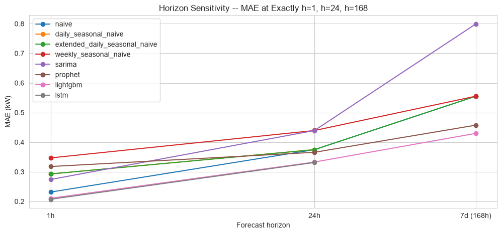

# Energy Demand Forecasting

Day-ahead household electricity demand forecasting, built as a rigorous,
end-to-end comparison of forecasting paradigms — classical statistics
(SARIMA), decomposition (Prophet), gradient boosting (LightGBM), and deep
learning (LSTM) — evaluated on identical rolling-origin backtests, with
statistical significance testing, seasonal breakdowns, and a dedicated
horizon-sensitivity investigation, not just a single leaderboard table.

## The question

*Can a trustworthy 24-hour-ahead demand forecast be built for a real
household power series, and which forecasting paradigm actually holds up
under scrutiny — not just on average, but across time, season, and horizon?*

## Headline result

| Method | MAE (kW) | RMSE (kW) | vs. baseline |
|---|---|---|---|
| **LightGBM** (direct multi-horizon) | **0.429** | **0.591** | −19% MAE |
| LSTM (direct seq2seq) | 0.440 | 0.605 | −17% MAE |
| Prophet | 0.485 | 0.637 | −9% MAE |
| Daily seasonal naive (baseline) | 0.530 | 0.786 | — |
| SARIMA(3,1,0)(2,0,0)[24] | 0.560 | 0.776 | +6% MAE (worse) |

LightGBM and LSTM are the clear top tier — but a Diebold-Mariano
significance test found the gap *between them* is **not** statistically
significant (p = 0.098). Every other pairwise comparison is significant at
p < 0.001. That nuance, and several others like it, is the point of this
project: a single MAE column hides more than it reveals.

**A few findings that only showed up once the analysis went past the
aggregate table:**

- **The 24h winner isn't the whole story.** Re-running models at 1h and 7d
  horizons found LightGBM/LSTM stay on top throughout, but SARIMA goes from
  competitive at 1h to the single *worst* method of any kind at 7d (0.800
  MAE — worse than flat persistence), while Prophet moves the opposite
  direction, climbing from one of the weakest methods at 1h to 2nd-best at
  7d.

  

- **The naive baseline beats SARIMA and Prophet outright in summer.** Time-
  series cross-validation across 4 seasonal folds found low, stable summer
  demand makes yesterday's value nearly unbeatable — added model complexity
  doesn't pay off there.
- **A real data-leakage bug was caught and fixed mid-project**, not
  glossed over: a naive baseline's fixed 24h lag silently looked up
  future values once asked for a horizon longer than 24h. Caught before it
  could distort the 7-day results, fixed with a guard clause and a
  regression test.
- **LightGBM's engineered anomaly-flag feature measurably pays off**:
  failure-case analysis found its worst predictions land on already-known
  anomalous days half as often as LSTM's or Prophet's.

Full reasoning, caveats, and every finding above (plus a dozen more) are in
[`ROADMAP.md`](ROADMAP.md) and the notebooks themselves — every notebook
ends with a `Findings` section written against real, executed output, not
aspirational claims.

## Business impact & recommendation

Phase 10 translates the accuracy numbers above into operational terms
rather than stopping at MAE: **MAE governs expected imbalance settlement
cost, RMSE governs the reserve margin needed to cover forecast risk** — two
different operational costs, not one "accuracy" number. LightGBM's real,
recomputed improvement over the baseline (MAE −19.2%, RMSE −24.8%), scaled
through an explicit, adjustable assumption cell (10,000-household
portfolio, $20/MWh imbalance premium — clearly illustrative, not a
validated utility ROI figure), works out to roughly **$178k/year** in
avoided imbalance cost.

**Recommendation:** ship **LightGBM** — best or statistically-tied-best
accuracy at every horizon tested, cheapest to retrain, the only model
proven to extend across horizons without an architecture change, and the
only one with a built-in explainability story (SHAP). Keep **Prophet** as a
secondary choice for longer-horizon planning conversations with
non-technical stakeholders. Don't ship **SARIMA** — it loses to the naive
baseline in most seasons and collapses at 7d. Treat **LSTM** as a validated
research result (raw sequence learning matches a feature-engineered GBM),
not a production pick — its accuracy gap with LightGBM isn't statistically
significant, so its materially higher training cost buys nothing.

See [`notebooks/10_business_impact.ipynb`](notebooks/10_business_impact.ipynb)
for the full reasoning, the demand-planning implications tied back to each
earlier phase's findings, and the operational trade-off table.

## Project structure

```
energy-demand-forecast/
├── data/
│   ├── energy.duckdb          # analytical DB: minute / hourly / daily / hourly_features tables
│   ├── processed/              # cleaned Parquet at each resolution
│   ├── results/                 # saved backtest results per model (long-format, reused across notebooks)
│   └── forecasts/                # batch prediction outputs (gitignored, regenerable)
├── models/                  # serialized production model bundle (gitignored, regenerable)
├── notebooks/
│   ├── 01_eda_trends_seasonality.ipynb
│   ├── 02_anomaly_detection.ipynb
│   ├── 03_feature_engineering.ipynb
│   ├── 04_forecasting_baselines.ipynb
│   ├── 05_model_sarima.ipynb
│   ├── 06_model_prophet_lightgbm.ipynb
│   ├── 07_model_lstm.ipynb
│   ├── 08_model_comparison.ipynb          # Phase 9A: 24h benchmark, CV, DM tests, seasonality, failure cases
│   ├── 09_horizon_sensitivity.ipynb        # Phase 9B: 1h / 24h / 7d comparison
│   ├── 10_business_impact.ipynb            # Phase 10: cost impact, trade-offs, production recommendation
│   └── 11_production_pipeline.ipynb        # Phase 11: production pipeline demo + validation vs. research
├── src/
│   ├── data/              # download, cleaning, schema validation, DuckDB loading
│   ├── features/          # leak-free lag/rolling/calendar feature engineering
│   ├── models/             # sarima.py, prophet_model.py, lightgbm_direct.py, lstm.py
│   ├── evaluation/         # shared train/test split, backtest harness, metrics, significance testing
│   ├── pipeline/           # production: preprocessing orchestration, inference features,
│   │                         # model serialization, MLflow registry, batch prediction, scheduling
│   ├── api/                # FastAPI app serving the production model (health + forecast endpoints)
│   └── dashboard/          # Streamlit app: live forecast, model comparison, anomalies, business KPIs
├── tests/                  # pytest suite mirroring src/, 111 tests
├── Dockerfile              # containerizes the API (bakes in the trained model + DuckDB)
├── ROADMAP.md              # phase-by-phase plan, decisions, and findings (the project's real changelog)
└── pyproject.toml
```

## Methodology at a glance

1. **Data engineering** — the UCI Individual Household Electric Power
   Consumption dataset (minute-level, 2006–2010, ~2M rows), cleaned,
   schema-validated with Pandera, and loaded into DuckDB at minute/hourly/
   daily resolutions.
2. **EDA, anomaly detection, feature engineering** — trend/seasonality
   decomposition, four independent anomaly-detection methods cross-checked
   against each other, leak-free lag/rolling/cyclical features (verified by
   tests, not just by inspection).
3. **A shared evaluation harness, built once, reused by every model** —
   the same train/test split, the same rolling forecast origins, the same
   metrics (MAE/RMSE/MAPE/sMAPE), so every model in the project is judged
   on identical terms.
4. **Four forecasting paradigms, same 24h-ahead benchmark**: seasonal
   naive baselines → SARIMA → Prophet & direct multi-horizon LightGBM →
   direct sequence-to-sequence LSTM (PyTorch, Optuna-tuned).
5. **Evaluation that goes past a leaderboard**: time-series
   cross-validation, Diebold-Mariano significance testing, per-season
   breakdowns, failure-case analysis, and a dedicated 1h/24h/7d horizon-
   sensitivity study.

See [`ROADMAP.md`](ROADMAP.md) for the full phase-by-phase breakdown,
including deferred/optional items and the reasoning behind every design
decision.

## Tech stack

- **Data**: DuckDB, Parquet, Pandera (schema validation)
- **Modeling**: statsmodels/pmdarima (SARIMA), Prophet, LightGBM, PyTorch
  (LSTM)
- **Tuning & tracking**: Optuna, MLflow (experiment tracking + Model Registry)
- **Evaluation**: scipy (Diebold-Mariano), custom rolling-origin backtest
  harness
- **Production**: joblib (model serialization), a bounded-window inference
  feature pipeline, MLflow pyfunc for a single deployable model interface
- **API**: FastAPI, Pydantic, Docker
- **Dashboard**: Streamlit, Plotly
- **Tooling**: uv (dependency management), pytest, Jupyter

## Getting started

```bash
# Install dependencies (Python 3.12)
uv sync

# Build the dataset (download → clean/resample → DuckDB → features)
uv run python -m src.data.download
uv run python -m src.data.load
uv run python -m src.data.duckdb_setup
uv run python -m src.features.build_features

# Run the notebooks in order (01 through 11), or open them in Jupyter/VS Code

# Train and register the production model, then run a batch forecast
uv run python -m src.pipeline.registry
uv run python -m src.pipeline.predict

# Run the test suite
uv run pytest

# View MLflow experiment tracking + Model Registry (SARIMA/Prophet/LightGBM/LSTM runs,
# plus the registered "energy-demand-lightgbm-direct" production model)
uv run mlflow ui
```

See [Running the API](#running-the-api) below to serve the trained model over
HTTP, or [Running the Dashboard](#running-the-dashboard) for the interactive
Streamlit app.

## Running the API

Requires the model bundle from the registry step above
(`uv run python -m src.pipeline.registry`) to exist at
`models/lightgbm_direct_bundle.joblib`.

**Directly with uvicorn** (fastest for local dev):

```bash
uv run uvicorn src.api.main:app --reload
```

- `GET http://127.0.0.1:8000/health` — status + which model version is loaded
- `POST http://127.0.0.1:8000/forecast` with body `{}` (latest available data)
  or `{"as_of": "2010-11-26T21:00:00"}` — returns the 24h forecast
- `http://127.0.0.1:8000/docs` — interactive Swagger UI, easiest way to try
  it without curl

```bash
curl -X POST http://127.0.0.1:8000/forecast -H "Content-Type: application/json" -d '{}'
```

**Or in Docker** (bakes in whatever's currently in `models/` and
`data/energy.duckdb` at build time — rebuild the image after retraining):

```bash
docker build -t energy-demand-forecast-api .
docker run --rm -p 8000:8000 energy-demand-forecast-api
```

`--rm` deletes the container as soon as it stops — without it, every
`docker run` leaves behind a new stopped container (`docker ps -a` piles
up), since `run` always creates a fresh container rather than reusing the
last one. For a longer-lived local instance, name it and reuse that name
instead of `--rm`:

```bash
docker run -d --name energy-api -p 8000:8000 energy-demand-forecast-api
docker stop energy-api
docker start energy-api   # reuses the same container
```

Same endpoints, same port, either way.

If `/health` returns a 503, the model bundle is missing — regenerate it with
`uv run python -m src.pipeline.registry`.

## Running the Dashboard

Requires the same model bundle as the API, plus every file under
`data/results/` (already committed — no extra step needed for those).

```bash
uv run streamlit run src/dashboard/app.py
```

Opens at `http://localhost:8501` with four pages in the sidebar:

- **Live Forecast** — pick any timestamp in the dataset, get a real 24h
  forecast from the production model, compared against actuals where known,
  with an empirical prediction interval
- **Model Comparison** — the 24h benchmark leaderboard, plus the Phase 9B
  1h/24h/7d horizon-sensitivity comparison
- **Anomaly Detection** — the 27 Phase 3-flagged days plotted against the
  full series
- **Business Impact** — Phase 10's cost-savings estimate, with portfolio
  size and imbalance premium as live sliders

Every number shown is computed live from `data/results/` or the model
bundle — nothing is hardcoded from this README.

## Testing

119 tests covering the data pipeline, feature engineering, every model's
core logic, the evaluation harness, the statistical significance testing
utilities, the production pipeline, the API, and the dashboard —
including regression tests for the data-leakage bug mentioned above and
for a categorical-feature-encoding edge case caught while building Phase
11. Run with `uv run pytest`; slow tests (fitting real Prophet/SARIMA/LightGBM
models, or hitting the real DuckDB database) are marked and can be excluded
with `uv run pytest -m "not slow"`.

## Data source

[UCI Machine Learning Repository — Individual Household Electric Power
Consumption](https://archive.ics.uci.edu/ml/machine-learning-databases/00235/household_power_consumption.zip),
one household's minute-level electricity consumption, December 2006 –
November 2010.

## Roadmap

**Phases 1–10 are complete — a portfolio-complete checkpoint** (data → EDA →
anomalies → features → baselines → classical → ML/DL → rigorous evaluation →
business impact). **Phases 11–13 (production pipeline, API, dashboard) are
complete too** — the Phase 10-recommended LightGBM model is trained,
serialized, registered in an MLflow Model Registry, and now servable three
ways: a batch/scheduling pipeline that reproduces the research backtest to
within 0.9% MAE on the exact same held-out origins, a FastAPI service
(`/health`, `/forecast`) run for real both bare-metal and in a
built-and-run Docker container, and a four-page Streamlit dashboard
(live forecasts, model comparison, anomalies, business KPIs) verified with
a real headless-browser session against the actual running app. Phases
14–16 (MLOps, deployment, portfolio docs) are the remaining
second-milestone work — see [`ROADMAP.md`](ROADMAP.md) for the full plan.
